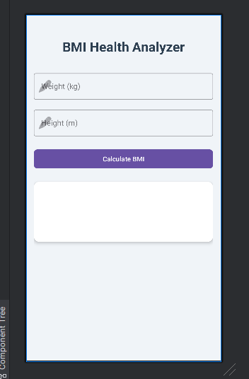

# My BMI

My BMI is a simple Android app that calculates BMI (Body Mass Index) based on weight and height. It is designed to be used by people who want to monitor their health and fitness.

## Features

- Calculates BMI based on weight and height.
- Displays BMI in a user-friendly format.
- Provides a clear and concise user interface.
- Offers advices and tips for maintaining a healthy lifestyle.

## Screenshots

## Requirements

- Android Studio
- Android SDK
- Android Emulator

## Installation

1. Clone the repository to your local machine.
2. Open the project in Android Studio.
3. Run the app on an Android emulator or a physical device.

## Contributing

Contributions are welcome! If you find a bug or have a suggestion, please open an issue or submit a pull request.

## License

This project is licensed under the MIT License. See the LICENSE file for more information.
