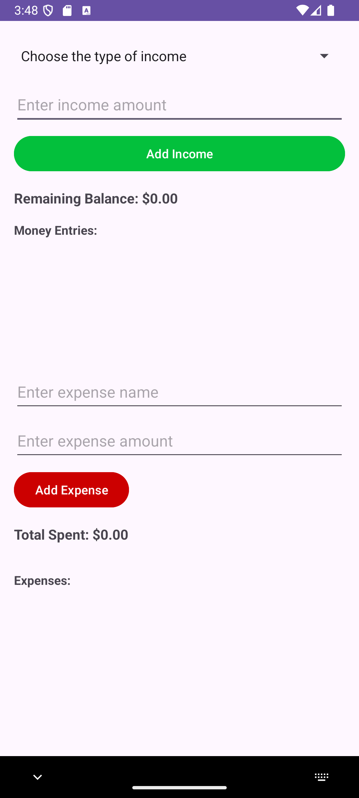

# expense-tracker-app

This is an expense tracker app that helps users to keep track of their expenses. It allows users to add their expenses, categorize them, and view their spending over time. The app also provides a summary of the user's expenses, which can be helpful for budgeting and financial planning.

## Features

- Users can add expenses, categorize them, and view their spending over time.
- Users can view their expenses in a summary, which can be helpful for budgeting and financial planning.

## Screenshots Demo

## Requirements

- Android Studio
- Android SDK
- Android Emulator

## Installation

1. Clone the repository to your local machine.
2. Open the project in Android Studio.
3. Run the app on an Android emulator or a physical device.

## Contributing

Contributions are welcome! If you find a bug or have a suggestion, please open an issue or submit a pull request.

## License

This project is licensed under the MIT License. See the LICENSE file for more information.
